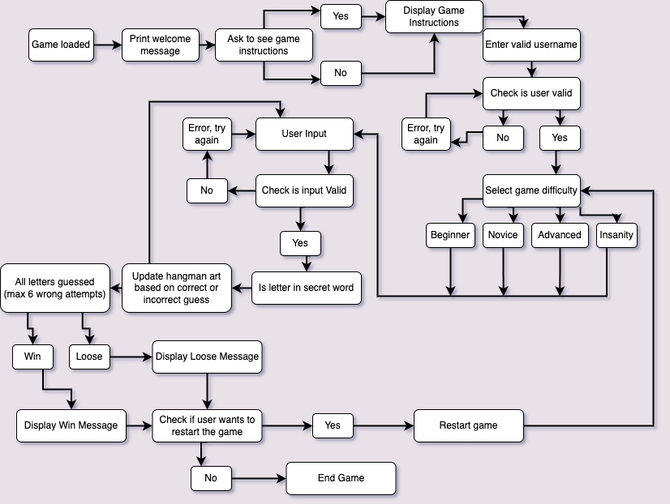
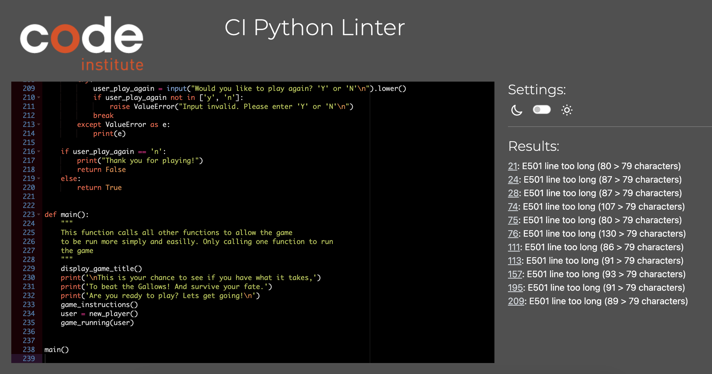
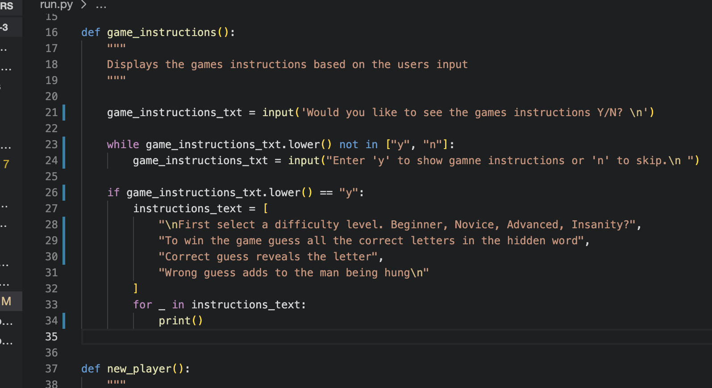
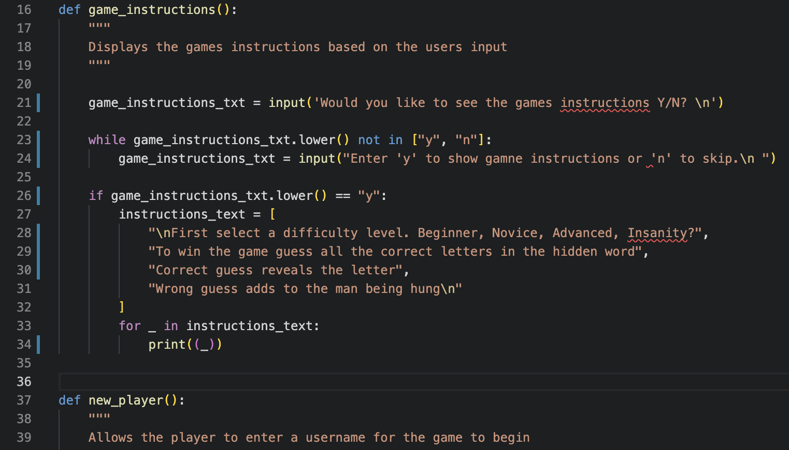
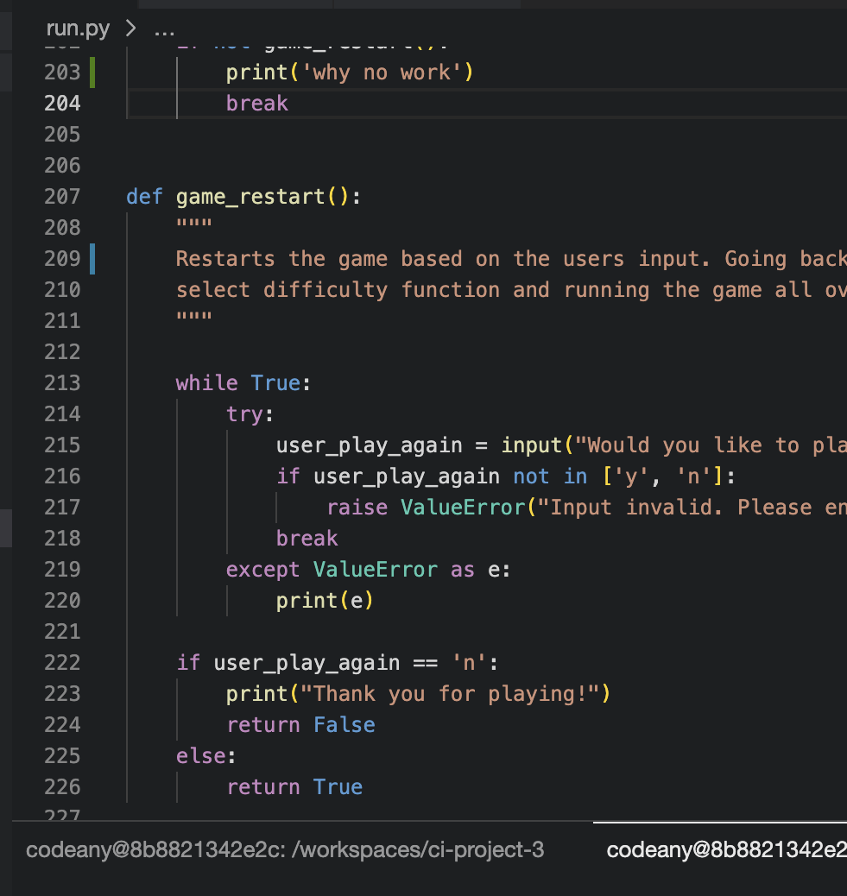

# Hangman

Click here to see the live [Hangman Game](www.hangmaneditthis.com)

Hangman is a traditional game that has been around through the ages. Testing the knowledge of your opponents spelling. 
Either played online against a computer or against a friend on paper. But this version is all online and built and designed to run 
in the command line. Using Python programming language. 

### Table of Contents

1. How to play
2. Logic Flow Chart
3. Features
4. Future Development
5. Technologies Used
6. Testing
7. Bugs/Fixed Bugs
8. Deployment
9. Credits

### How to play

Once the game has started the user is asked if they want to read the game instructions or just go ahead and play. 
Once they have decided wether to read or ignore, the user wis prompted to enter a username for the game.
They will then be asked what difficulty level they want to play 'Beginner, Novice, Advanced, Insanity'. All with 
varying levels of difficulty. 

The user then goes ahead and does there best to guess the secret word that has been selected from the difficulty level.
Trying to beat the gallows to win the game.

### Logic Flow Chart

The design and flow of the game was laid out before work on the codeing of the game begin. This was done to allow a clear direction in what way the game flows throughtout the users progress. Also then being able to determine what main functions are needed and what functions need to link together to allow the game to run as intended.

### Features

The current features in the game are as follows. Allowing for the game to function as intended. 

- Game rules - To tell and instruct the user how to play the game and how the game works.
- User Name Input - Alowing for a more personal feel and touch whilst playing the game. Also allowing for multiple users to keep track of who wins and looses
- Four levels of difficulty - To give the user a varied amount of words to play with 
- Guessed letters - To see and keep track of the current quesses 
- Visual Hangman figure and Word guessing - To give the visual apperance of a hang man figure
- Win and loose state - Giving different messages based on the outcnme of the game
- Game restart - Allowing the user to restart the game at the end once they have won or lost

### Future Development

The implemented features that are currently in the game allow it to run in the most simple form to get the job done and run the game of hangman for the players to be able play. But to keep things interesting and for future development of the game, features that could be added are:

- API - for new and totally random words
- Score board - So players can track there correct and wrong words (using a set amount of words in a game)
- Multiplayer - So users can play against there friends and family 
- New Word Topics - Allowing a user to select a word catagory and play with them words. Such as 'Animals'

### Technoligies Used

In the development of this project multiple technoligies were used to allow everything to function. 

- Github - Used for the source control of the game.
- Codeanywhere - The cloud development spcae allowing for the creating and testing of the game
- Python - The programming language behind the app powering it
- Heroku - Used for the final deployment and hosting of the game. Allowing users to play and interact with the application using the base frame provided by Code Institute

### Testing

During the development of the game. There were may tests that were made along the way to ensure everything was working as intended and going to plan. 

| Test | Steps Taken | Expected outcome | Result |
|------------------------------------------------|

| Guess a letter | Inputting letters | Checks if the input is valid | As expected |
| Guess correct | Inputting correct guesses | Checks the letter, Displays correct message | As Expected |

Once the game was completed and everything was running as intended. The code was then put through CI pip8 Python testing. Despite having long line errors. There are no other present python code errors. All issues apart from the long line errors were fixed before deployment.

| See Game Instructions | Testing pressing 'y' and 'n' to see if they show or go to the next step in the game | If 'y' pressed game insturctions appear. If 'n' Pressed enter username appears | As expected |
| Enter Valid Username | Entering various spelling/spelling mistakes/numbers into the terminal to test the output of the game | When a valid username is entered it will start the game. If amn invalid username is entered it will raise a ValueError and reset the enter username part of the game. | As Expected |
| Personalised welcome message | Running the game | Displys a message with the users inputted username | As Expected |
| Select Difficulty | Testing the different difficulty selections | Changes the difficulty of the game, selecting different words based on the selected difficulty | As Expected | 

| Guess incorrect | Inputting numbers/incorrect letters | Checks invalid entry, outputs wrong message and displays updated hangman image | As Expected |
| Multiple guess | Repeating the guessed letter | Entering the same letter multiple times. Display already guessed message | As Expected |
| Win | Entering the correct answer | Displays the congratulations message and that the user survived | As Expected |
| Loose | Entering the incorrect answer | Displays the 'dead' hangman and loose message | As Expected |
| Restart Game | Entering the 'y' and 'n' key to restart or end the game | Restart the game when 'y' is entered or end the game when 'n' is entered | As Expected |

### Bugs/Bug Fixes

During the development there were many bugs despite the constant testing of the game thoughout the development. With most of them being a minor fix, such as an indentation error or general spelling mistake some were requiring re writes of code. 

- Game not showing the game instructions despite the user enter 'y' to view them.

- Game not restarting when the user entered 'y' to restart the game at the end of the game. 

### Deployment

Deployment of the game was done by using Heroku. Whilst hosting the files Github and linking the two together. 

GITHUB:

- Repository created using the CI P3 Template
- Code pushed up to github thoughout development

Upon final build of code, a heroku app was created and by using the following steps, the game was deployed.

- Login to Heroku 
- On main page select 'create new app'
- Choose a unique name for the app. And choose region
- Once app has been created, navigate to settings - config vars
- Clicking on reveal config vars and add "PORT"  value "8000" 
- Add buildpacks for "Python" and "Node.js" ensuring that Pythons buildpack is deployed first
- Navigate to the deploy tab. And deploy from Github Repository
- Scroll to bottom of the page and select "Enable Automatic Deploys" 
- Deployed Project Here - (Play the game)[www.hangman] 

### Credits

- Stackoverflow - Problem Solving and generic issues
- Google - Problem Solving
- Slack Comminuty - Inspiration and assistance for the project
- Mentor - Assistance along the way of the development of the project

